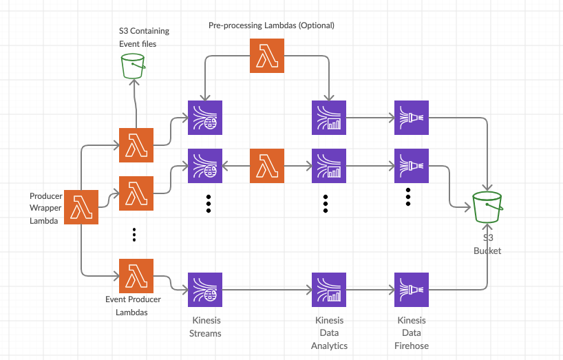

# Demo Streaming Application

## How to deploy?
### Prerequisites
1. CSV event files should be uploaded to an S3 bucket.
1. The name of the S3 bucket created in previous step should be assigned to `events_bucket` variable in [this file](infra/dev/apps/producer/actor/terraform.tfvars).
1. Create a `config` or `credentials` file anywhere on your machine containing desired AWS credentials.
 
### Deploy  
Run `./deploy.sh`

It takes a bit longer for the deployment container to start the first time `deploy.sh` runs as it needs to build the Docker image with required tooling for deployment. When container starts running, user will be prompted by interactive terragrunt to answer a few questions.

### How to Produce Events?
When deployment is done, the wrapper Lambda function needs to be called with an event similar to the following:
````
[
 {
    "stream": "custom-events-stream",
    "bucket": "data-files-demo",
    "file":"custom_events.csv"
 },
 {
    "stream": "groups-stream",
    "bucket": "data-files-demo",
    "file": "groups.csv"
 }
]
````

## How does it work?


At the beginning of the pipeline, `wrapper` Lambda calls `producer` Lambdas to produce events. Each producer Lambda in this application is responsible to produce an event type.
In this design each event type is going to a separate Kinesis Stream, and from there events are processed by a pre-processing Lambda function if desired by the Kinesis Analytics Consumer. When events are consumed by Kinesis Analytics, the result will be pushed to Kinesis Firehose dedicated to that event type where they can be pushed to S3 or Redshift for further use.